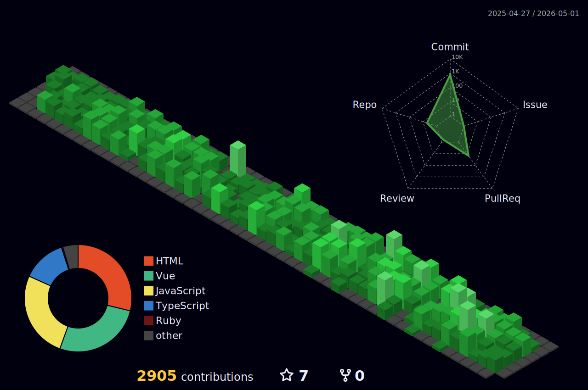

## Hi there 👋 I'm An (a.k.a ph4n4n)

Backend developer & database holic who enjoys building practical tools with clean architecture.

---

### 🛠️ Tech Stack
- Languages: **TypeScript**, **SQL**, **Shell**, **Javascript**
- Backend: **Node.js**, **NestJS**, **Express**
- Database: **MySQL**, **PostgreSQL**
- Tools: **Docker**, **Git**

---

### 📌 Featured Projects

#### 🔍 [andb-core](https://github.com/ph4n4n/andb-core)
> **A DDL comparator & migration tool**  
> Compare/export/apply schema diffs for MySQL-compatible databases.  
> Supports tables, functions, procedures, and triggers (views coming soon).

#### 📑 [andb-logger](https://github.com/ph4n4n/andb-logger)
> **Minimal and structured logger for TypeScript/Node.js**  
> Built for CLI and backend tools. Outputs clean, color-coded logs with time supported via timezone setup.

### 🧮 [vietnam-pit](https://github.com/ph4n4n/vietnam-PIT)
> **Minimal Vietnam Personal Income Tax Calculator - Comparison between the 2025 Tax Law and the new 2026 Tax Law.**

> Features
  - Calculates personal income tax from gross or net income
  - Parallel comparison of 2025 vs 2026 tax rates
  - Supports 4 minimum wage regions
  - Calculates dependents (family allowance deductions)
  - Displays year-end tax refunds
  - Responsive interface, mobile supported
---

### 📊 GitHub Stats

---
### 📫 Contact Me

- 📧 Email: [ph4n4n@gmail.com](mailto:ph4n4n@gmail.com)  
- 💼 LinkedIn: [https://www.linkedin.com/in/anph/](https://www.linkedin.com/in/anph)  
- 🧑‍💻 GitHub: [github.com/ph4n4n](https://github.com/ph4n4n)

<!--
**ph4n4n/ph4n4n** is a ✨ _special_ ✨ repository because its `README.md` appears on your GitHub profile.
-->
